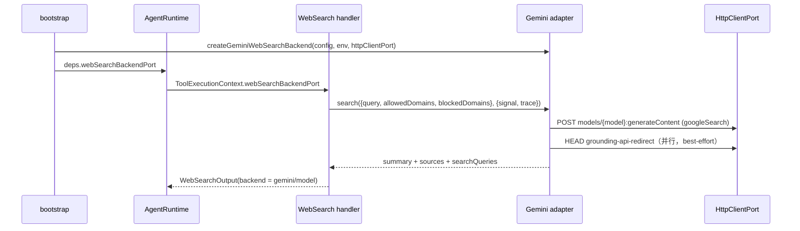

# WebSearch 的 Gemini 搜索后端

## 背景

`WebSearch` 工具原先只有一条执行路径：用当前 Active Model 发一次内部模型请求，挂上
provider-native `web_search` 工具（Anthropic Messages 的服务端搜索）。当前模型的
`properties.supportsNativeWebSearch` 为 false 时，`WebSearch` 不会暴露给模型。

参考 omp 的 `web` 角色默认链（`google/gemini-2.5-flash`，Gemini Developer API + Google Search
grounding），为 CLI 增加一个与 Active Model 无关的 Gemini 搜索后端。

## 产品规则

- 只在用户配置 `webSearch.provider = "gemini"` 时启用；默认 `"native"`，保持原行为。
  不因环境里恰好存在 `GEMINI_API_KEY` 就自动切换，避免静默改变计费与数据流向。
- 启用后 **Gemini 优先**：所有 `WebSearch` 调用都走 Gemini，不论当前模型是否支持原生搜索；
  `WebSearch` 对所有模型暴露（主会话、子代理、workflow 子会话一致）。
- 默认模型 `gemini-2.5-flash`，默认端点 `https://generativelanguage.googleapis.com/v1beta`。
- 仅支持 Gemini Developer API（API Key）。omp 另有 Cloud Code Assist OAuth 路径，ZCode 无对应
  凭据体系，本次不实现。

## 配置

用户配置文件 `~/.zcode/cli/config.json`：

```json
{
  "webSearch": {
    "provider": "gemini",
    "gemini": {
      "apiKey": "<your-gemini-api-key>",
      "model": "gemini-2.5-flash",
      "baseUrl": "https://generativelanguage.googleapis.com/v1beta"
    }
  }
}
```

| 字段 | 默认 | 说明 |
|---|---|---|
| `webSearch.provider` | `"native"` | `"native"` 走当前模型原生搜索；`"gemini"` 走 Gemini |
| `webSearch.gemini.apiKey` | 无 | 缺省时依次读取 `GEMINI_API_KEY`、`GOOGLE_API_KEY` |
| `webSearch.gemini.model` | `gemini-2.5-flash` | 任意支持 `googleSearch` 工具的 Gemini 模型 id |
| `webSearch.gemini.baseUrl` | `https://generativelanguage.googleapis.com/v1beta` | 需为 http(s) 绝对地址；可指向兼容网关 |

- API Key 优先级：配置文件 `apiKey` > `GEMINI_API_KEY` > `GOOGLE_API_KEY`。这两个是 Google 生态
  既有变量，不新增 `ZCODE_` 变量。环境变量只在 adapter 层读取。
- **`webSearch` 只接受 User / Env / CLI 层**。Project（工作区）配置里的 `webSearch` 在合并时丢弃：
  否则仓库可以把 `baseUrl` 指向任意地址，把用户环境里的 Key 发出去。
- 网络代理、自定义 CA、超时沿用 `network.*`（复用同一 `HttpClientPort`）。

## 所有者与接口

- 配置事实：`RuntimeConfig.webSearch`（contracts），由 adapters 的配置加载器解析与合并。
- 后端能力：`WebSearchBackendPort`（contracts）。bootstrap 在 `provider = "gemini"` 时构造
  Gemini 实现（adapters），否则不构造。端口存在与否是唯一的路由事实，core 不读配置。
- 执行：core `WebSearch` handler。`context.webSearchBackendPort` 在场即走后端，否则走原生路径。
- 暴露：`getTools` 在 runtime 持有端口时总是暴露 `WebSearch`；否则按模型 `supportsNativeWebSearch`。



## 请求与结果

- 请求：`POST {baseUrl}/models/{model}:generateContent`，头 `x-goog-api-key`，
  `tools: [{ googleSearch: {} }]`，一段 system instruction 要求基于搜索结果回答并列出来源。
- 域名过滤：Gemini `googleSearch` 无域名参数。`allowed_domains` 编码为
  `(site:a OR site:b)`，`blocked_domains` 编码为 `-site:x`，追加到查询词。
- `maxUses` 对 Gemini 无效（由模型自行决定搜索次数）。
- 结果：`candidates[0].content.parts[].text` 拼成 summary；
  `groundingMetadata.groundingChunks[].web` 去重后作为 results/sources；
  `webSearchQueries.length` 记为 `webSearchRequests`；输出附 `backend: { provider: "gemini", model }`。
- `vertexaisearch.cloud.google.com/grounding-api-redirect/...` 链接用 `HEAD` + 手动重定向解析
  为真实 URL（5 秒超时）。解析失败保留原链接（该链接本身可跳转），不影响结果。
- 不回填 `modelUsage`：Gemini 的 token 不属于会话模型，写进会话用量会污染上下文/计费统计。

## 失败语义

| 场景 | 行为 |
|---|---|
| `provider = "gemini"` 但无 API Key | 端口仍构造、`WebSearch` 仍暴露；调用时抛 `configuration_error`（recoverable），提示配置项与环境变量名 |
| `baseUrl` 非法 | 同上，调用时抛 `configuration_error` |
| HTTP 429 / 500 / 502 / 503 / 504 | 最多重试 2 次，退避 1s、2s；取消信号立即终止 |
| 其他非 2xx | 抛 `model_error`，带状态码与脱敏后的响应片段（截断 500 字符，Key 替换为 `[redacted]`） |
| 响应无文本且无来源 | 抛 `model_error`（empty grounded response） |
| 用户取消 / 工具超时 | 由 `HttpClientPort` 的 `cancelled`/`timeout` 错误向上冒泡 |

## 验收场景

1. 未配置 `webSearch`：行为与改动前一致（仅原生搜索模型暴露 `WebSearch`）。
2. 配置 `provider: "gemini"` + Key：任意模型都暴露 `WebSearch`，调用发往 Gemini，结果包含 summary、
   去重后的真实 URL、`backend.provider = "gemini"`。
3. 配置 `provider: "gemini"` 但无 Key：调用返回可读的配置错误。
4. 工作区 `.zcode` 配置中的 `webSearch` 不生效。
5. `allowed_domains` / `blocked_domains` 转成 `site:` 运算符出现在请求查询中。
